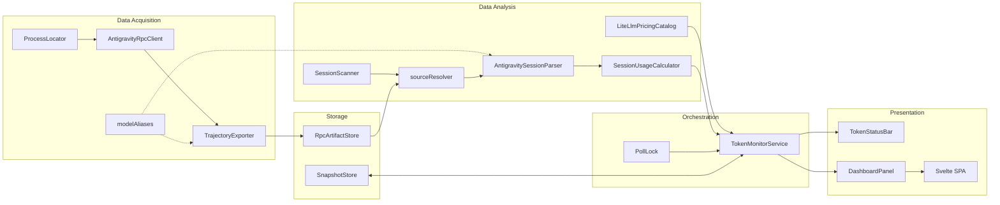

# Architecture — Antigravity Token Monitor

> VS Code 익스텐션: Antigravity 세션 토큰 사용량을 자동 수집·분석·시각화

상세 아키텍처 문서: [docs/architecture.md](docs/architecture.md)

---

## Domain Map



---

## Module Layering

의존 방향은 **아래에서 위로**만 허용됩니다.

```
Types / Config          ← 공유 타입, 설정 읽기 (순수 함수)
       ↑
Storage                 ← RPC 아티팩트, 스냅샷 영속화
       ↑
Data Acquisition (rpc/) ← 프로세스 탐지, RPC 통신, JSONL 직렬화
       ↑
Data Analysis           ← 세션 스캔, 소스 결정, 토큰 파싱, 비용 산정
       ↑
Orchestration (monitor/)← 타이머, 락, 이벤트, 상태 집계
       ↑
Presentation            ← StatusBar + Webview (Svelte)
       ↑
Extension Entry         ← activate/deactivate, 커맨드 등록
```

---

## Key Integration Points

| 경계 | 통신 방식 | 프로토콜 |
|------|-----------|----------|
| Extension ↔ Antigravity | HTTPS RPC (localhost) | Connect Protocol v1 |
| Extension ↔ Webview | `postMessage` / `onDidReceiveMessage` | JSON 메시지 |
| Extension ↔ FileSystem | `fs.readFile` / `fs.writeFile` | JSONL + JSON |
| Multi-instance | 파일 기반 락 (`PollLock`) | PID + timestamp |

---

## Build Topology

```
esbuild.js
├── Extension Build (Node CJS)
│   entry: src/extension.ts → dist/extension.js
│   platform: node, target: node18
│   external: ['vscode']
│
└── Webview Build (Browser IIFE)
    entry: src/webview/main.ts → dist/webview/main.js
    platform: browser, target: es2020
    plugins: [esbuild-svelte]
```

---

## Data Flow

```
Antigravity Process (language_server)
    │ ps + lsof (프로세스 탐지)
    ▼
ProcessLocator → port, csrfToken
    │
    ▼
AntigravityRpcClient (HTTPS, 자체 서명)
    │ GetCascadeTrajectoryGeneratorMetadata
    ▼
TrajectoryExporter → usage.jsonl (로컬 캐시)
    │
    ▼
SessionScanner + sourceResolver (소스 결정)
    │
    ▼
AntigravitySessionParser (reported | estimated)
    │
    ▼
TokenMonitorService (집계 + 비용 산정)
    ├→ TokenStatusBar (상태바)
    └→ DashboardPanel → Svelte SPA (대시보드)
```

---

## Test Strategy

| 대상 | 프레임워크 | 환경 | 패턴 |
|------|-----------|------|------|
| Extension 로직 | Vitest | jsdom | 코로케이트 (`*.test.ts`) |
| Webview 컴포넌트 | Vitest + Testing Library | jsdom | `src/webview/test/` fixtures + mocks |
| 타입 체크 (Extension) | `tsc --noEmit` | - | `npm run typecheck` |
| 타입 체크 (Webview) | `svelte-check` | - | `npm run typecheck:webview` |

---

## Storage Layout

```
~/.gemini/antigravity/
├── brain/{sessionId}/          ← Antigravity 네이티브 세션 데이터
└── .token-monitor/             ← 본 익스텐션 관리 영역
    ├── rpc-cache/v1/{sessionId}/
    │   ├── manifest.json       ← 내보내기 메타데이터
    │   ├── usage.jsonl         ← 토큰 사용량 레코드
    │   └── steps.jsonl         ← (선택) 대화 스텝
    ├── refresh.lock            ← 리프레시 중복 방지
    └── export.lock             ← 내보내기 중복 방지

VS Code globalStorageUri/
└── monitor-state.json          ← 영구 스냅샷 히스토리
```
